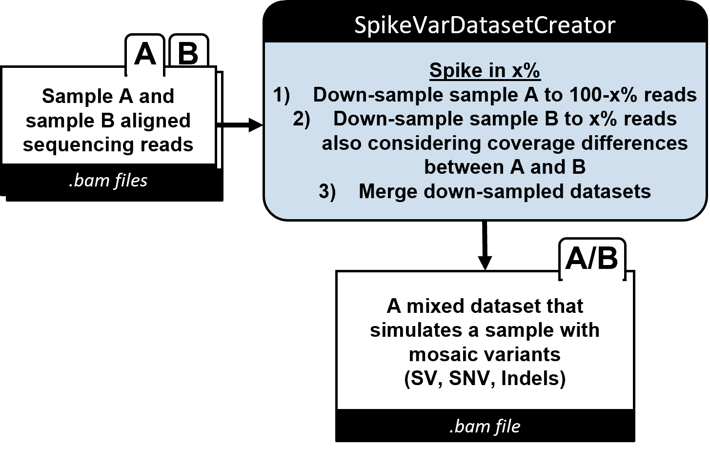
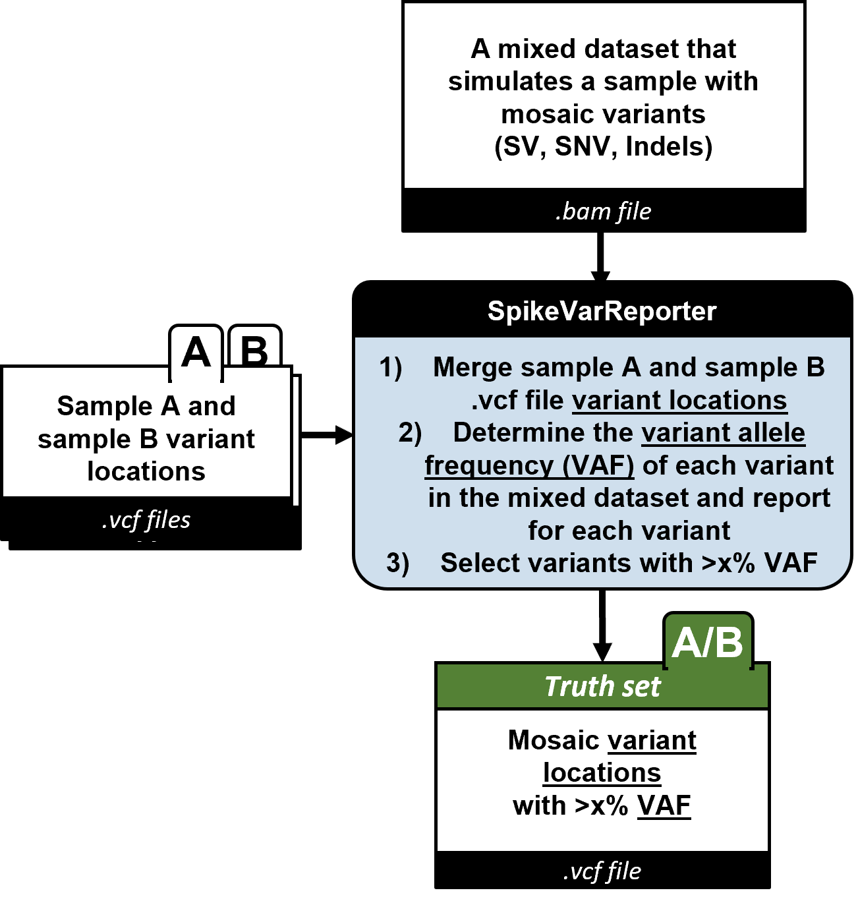
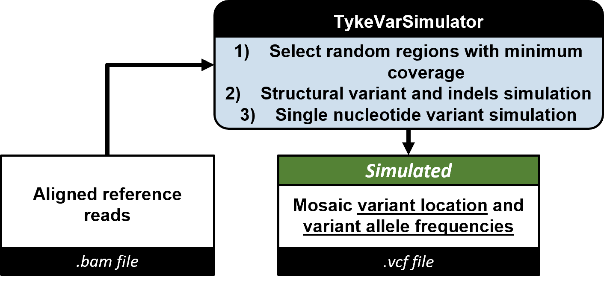
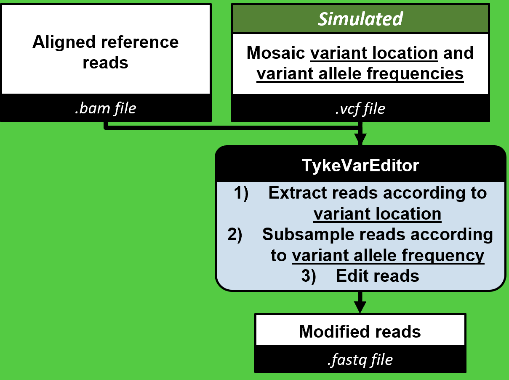
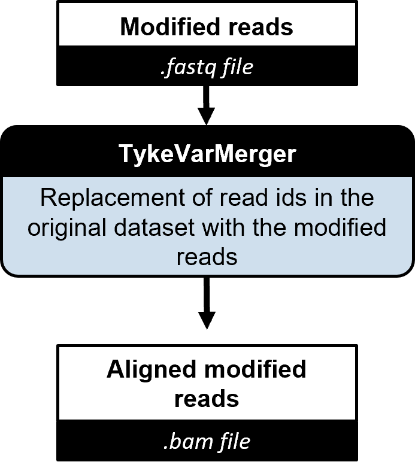
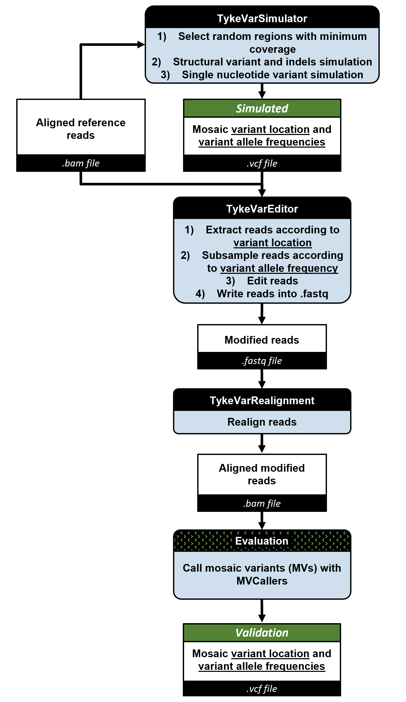

# MosaicSim: Simulation of mosaic variants in sequencing data

**Hackathon team: Lead: Fritz Sedlazeck - Developers: Xinchang Zheng, Michal Izydorczyk, Chi-Lam Poon, Philippe Sanio, Farhang Jaryani, Joyjit Daw, Divya Kalra - Writers: Erik Stricker, Sontosh Deb**

*MosaicSim provides two simulation workflows which output sequencing read files with artificial mosaic variants and a ground truth mosaic variantannotation file for the validation of mosaic variant callers.*


## Table of Contents
|1. [Background](#background)<br>2. [Installation](#installation)<br>3. [How to use it](#how-to-use-it)<br>4. [Example implementation](#example-implementation)<br>5. [Method Description](#method-description)<br>6. [Contributers](#contributers)<br>7. [References](#references)<br>|<video src="https://github.com/collaborativebioinformatics/SVHack_simulatemosaic/assets/37314125/4d0dfe58-501c-4ee8-99ea-ff3411e23b4f" width="200" height="200" align="right">|
|:------|-:|


## Background


In the context of individual genome comparison, mutations that appear within a small fraction of the population (<5%) are considered uncommon variants[<sup>1</sup>](#1). When assessing a population of cells from a tissue of the same individual in turn, uncommon variants only present in a small fraction of the cells are defined as a mosaic variants (MVs)[<sup>2</sup>](#2). Recent studies have shown that there are potential disease association of for certain MVs[<sup>2</sup>](#2). However, MVs are a challenging to detect because they are mixed in with data from the non-mutated cells and present in the same sequencing file. Therefore, several pipelines have been developed or adjusted to extract mosaic single nucleotide, structural or indel variants from whole genome sequencing data such as Sniffles[<sup>3</sup>](#3), DeepMosaic[<sup>4</sup>](#4), Mutect2[<sup>5</sup>](#5), DeepVariant[<sup>6</sup>](#6). To benchmark and validate the efficiency and accuracy of these methods, sequencing files with known MVs are necessary. We developed two simulation workflows called SpikeVar (*Sp*ike *i*n *K*nown *E*xogenous *Var*iants) and TykeVar (*T*rack in *Y*our *K*ey *E*ndogenous *Var*iants), which output sequencing read files with artificial MVs and a ground truth annotation file for the MVs. SpikeVar accomplishes this by spiking in real reads from a sample at user defined ratio into the sequencing file from a second sample. In contrast, TykeVar creates a list of random mutations and modifies a fraction of existing reads to match the user defined MV frequency.


## Installation

This tool is written fully in python. To install the relevant dependencies, run
```
pip install -r $REPO_ROOT/requirements.txt
```
where `$REPO_ROOT` is the root folder of the repository.

Installing two conda environments with python 3.10
```
conda create -n mosaicSim python=3.10

conda activate mosaicSim
```
## Dependencies

### SpikeVar
- mosdepth 0.3.2
- samtools 1.15.1
- Python 3.6.8
- bcftools
- Paragraph 2.4a
- 
### TykeVar
- pysam (0.21.0) 
- numpy (1.25.2)
- biopython (1.81)

## How to use it

### SpikeVar

The spiked-in dataset simulates a sample with potential mosiac variants at a user-specified ratio. The re-genotyped VCFs of the samples and the VCF of the spiked-in dataset can be compared to evaluate AF < user-specified value.

#### 1) SpikeVarDatabaseCreator - Generate spiked-in dataset

  

In this step, x% of mutations are strategically introduced from sample A to sample B. Both datasets are down-sampled and then merged to create a mixed dataset that represents a sequence read dataset with mosaic variants, including structural variations (SVs), single nucleotide variations (SNVs), and insertions/deletions (indels). 

```
sh spike-in.sh <path to sampleA.bam> <path to sampleB.bam> <spike-in ratio x/100> <path to samtools binary> <path to mosdepth binary> <output dirpath> <path to script calculate_ratio.py>
```
#### 2) SpikeVarReporter

  

After creating the new merged BAM file, we have to re-calculate the variant allele frequency (VAF) for all variants.
First we merge both VCF files from with bcftools. Depending on the variants we either start a SNV or SV caller, which can recalculate the VAF of each variant. 
For SNVs we are using bcftools mpileup. For SVs and short read data we are using Paragraph from Illumina and for long read data Sniffles2 is used.

```
./2b_re-genotyping_main.sh VARIANT VAF VCF_1 VCF_2 MODIFIED_BAM OUTPUT_DIR, READ_LENGTH
```
#### 3) Run your favorite mosaic variant caller and compare results

### TykeVar

#### 1) TykeVarSimulator - Generate simulated VCF




The VCF simulator generates a random set of mosaic variants (SNVs and SVs). The variants
can be parameterized with VAF, number of variants to simulate and the size of the variations.
The generated file is in the Sniffles VCF format.

The variants generated here act as an input into the read editor step (described below) which
generates modified reads with the variants inserted into them. The same VCF file is also the
ground truth for evaluating mosaic variant callers.

```
python vcfgen.py <path_to_bam> <path_to_ref> <output_path_prefix>

e.g. python vcfgen.py chr22.bam hs37d5.fa chr22
The above generates a chr22SV.vcf and chr22SNV.vcf file
```

#### 2) TykeVarEditor - Generate edited reads based on simulated VCF


```
python main.py -v <SIMULATED_VCF> -b <BAM> -r <REF> -o <OUTPUT_FASTQ>
```



This command above takes in the VCF which determines which variants to introduce into the reads.
The BAM file is used to find the reads which overlap with variant locations. Only a subset of the reads
corresponding to a particular variant location are edited. This is determined by the allele frequency.
The output FASTQ file has the edited reads. The query name of each read is kept the same.

#### 3) TykeVarMerger - Re-align modified reads and merge them

After creating the modified BAM file we have to re-calculate the variant allele frequency (VAF) for all variants.
First all variants stored from both VCF files need to be merged and the VAF needs to be recalculated. 
Depending on the variants we either start a SNV or SV caller, which can recalculate the VAF of each variant. 
For SNVs we are using bcftools mpileup. For SVs and short read data we are using Paragraph from Illumina and for long read data Sniffles2 is used.

```
./2b_re-genotyping_main.sh VARIANT VAF VCF_1 VCF_2 MODIFIED_BAM OUTPUT_DIR, READ_LENGTH
```



#### 4) Run your favorite mosaic variant caller and compare results

## Example implementation

### SpikeVar

Here, we use the SpikeVar workflow to automatically spike in sample HG002 at a 5% concentration into sample HG0733, to result in a 5% mosaic variant allele frequency (VAF). A downside is that the generated mixed .bam file will include 4 haplotype structures which cannot be corrected for. Furthermore, certain variants (e.g. HG002 variants) will not be presented at the targeted VAF. Forexample, heterozygous variants will not be represented by 5% VAF but rather at ~2.5% VAF. To account for this we re-genotype variants and report only variants that should be identifiable at the user-defined threshold or higher VAF.   

#### 1) Fetch data
In order to spike-in sample B into sample A, the pipeline first needs an initial set of aligned reads. We used HG002 and HG00733 datasets.

Reads - `ftp://ftp-trace.ncbi.nlm.nih.gov/ReferenceSamples/giab/data/AshkenazimTrio/HG002_NA24385_son/Ultralong_OxfordNanopore/guppy-V3.2.4_2020-01-22/HG002_hs37d5_ONT-UL_GIAB_20200122.phased.bam` and `ftp://ftp-trace.ncbi.nlm.nih.gov/ReferenceSamples/giab/data/AshkenazimTrio/HG002_NA24385_son/Ultralong_OxfordNanopore/guppy-V3.2.4_2020-01-22/HG002_hs37d5_ONT-UL_GIAB_20200122.phased.bam.bai`


#### 2) SpikeVarDatabaseCreator - Generate spike-in dataset
We spiked 5% reads from HG0733 to HG002 for the next part of the workflow.
```
sh spike-in.sh HG002_hs37d5_ONT-UL_GIAB_20200122.phased.bam HG007733.bam 0.05 /software/bin/samtools /software/bin/mosdepth /output `pwd`/calculate_ratio.py
```
#### 3) SpikeVarReporter
After creating the new BAM file from e.g. HG002 and HG00733, we have to re-calculate the variant allele frequency (VAF) for all variants.
First we merge both VCF files from e.g. HG002 and HG00733 with bcftools. Depending on the variants we either start a SNV or SV caller, which can recalculate the VAF of each variant. 
For SNVs we are using bcftools mpileup. For SVs and short read data we are using Paragraph from Illumina and for long read data Sniffles2 is used.

```
./2b_re-genotyping_main.sh SV 0.05 HG002_SV.Tier1.vcf HG00377_SV.Tier1.vcf SPIKED.BAM ./ LONG
```

#### 4) Run your favorite mosaic variant caller

Run you choice of mosaic variant caller on the modified `HG002_ONT_hg37_chr5_HG00733_ONT_hg37_chr5_merged.sorted.bam` file and compare the results with the validation `.vcf` file.

[Screenshots for spiked variants](./scripts/Spike/Screen_shots.md)

### TykeVar

Here, we use the TykeVar workflow to modifiy reads of HG002 directly at their reference position by including artifical mutations to represent at variant allele frequency of 5%. In contrast to the above approach we do not introduce new haplotypes with this. However, more complex mutations (e.g. rearrangements, duplication or very long structural variants) will not be able to be introduced to the data itself, since the size of the reads is limited.


#### 1) Fetch data
In order to simulate and edit reads, the pipeline first needs an initial set of aligned reads and a reference. For our demonstration, we will use the GIAB datasets.

Reads - `ftp://ftp-trace.ncbi.nlm.nih.gov/ReferenceSamples/giab/data/AshkenazimTrio/HG002_NA24385_son/Ultralong_OxfordNanopore/guppy-V3.2.4_2020-01-22/HG002_hs37d5_ONT-UL_GIAB_20200122.phased.bam` and `ftp://ftp-trace.ncbi.nlm.nih.gov/ReferenceSamples/giab/data/AshkenazimTrio/HG002_NA24385_son/Ultralong_OxfordNanopore/guppy-V3.2.4_2020-01-22/HG002_hs37d5_ONT-UL_GIAB_20200122.phased.bam.bai`

Reference - `https://ftp-trace.ncbi.nlm.nih.gov/ReferenceSamples/giab/release/references/GRCh37/hs37d5.fa.gz`

#### 2) TykeVarSimulator - Generate variants and modified reads

First we decompress the FASTA file.
```
gunzip hs37d5.fa.gz -c hs37d5.fa
```

Then we simulate variants
```
python vcfgen.py HG002_hs37d5_ONT-UL_GIAB_20200122.phased.bam hs37d5.fa hg002
```

#### 3) TykeVarEditor - Add modified reads back in

Generate a set of modified reads with inserted variants.
```
python main.py -v hg002SV.vcf -b HG002_hs37d5_ONT-UL_GIAB_20200122.phased.bam -r hs37d5.fa -o hg002_modified_reads.fastq
```

#### 4) TykeVarMerger - Re-align modified reads and merge them
Once the new reads are generated, they need to be re-aligned and re-inserted back into the dataset by replacing the original reads.

We use `minimap2` for long read alignment and `bwa-mem2` for short reads. In the example, we tested on chromosome 22.
```
# indexing reference genome
bwa-mem2 index hs37d5.fa.gz

minimap2 -x map-ont -d mm2_hs37d5.mmi hs37d5.fa.gz

# mapping 
bwa-mem2 mem -t 14 ~/reference/hs37d5.fa.gz chr22.fastq -o bwa_align/chr22.sam
samtools view -bS --no-PG bwa_align/chr22.sam | \
    samtools sort -@ 12 --no-PG - > bwa_align/chr22.sorted.bam

minimap2 -a ~/reference/mm2_hs37d5.mmi -t 14 --secondary=no chr22.fastq | \
    samtools view -bS --no-PG - > mod.chr22.bam
```

Now that we have the alignments for modified reads, we then remove the old alignments with the same ids of modified reads in the original bam, then insert the new alignments of modified reads back to this bam. The `--primary` argument here is to ensure we only keep primary alignments in the final bam.

```
python filter_merge_bam.py -b chr22.HG002_hs37d5_ONT-UL_GIAB_20200122.phased.bam \
    -m mod.chr22.bam -o . --prefix mod_chr22 --primary
```

#### 4) Run your favorite mosaic variant caller

Run you choice of mosaic variant caller on the modified `mod.chr22.bam` file and compare the results with the simulated `hg0002SV.vcf` file.

## Method Description 

### 1. SpikeVar - Generation of sequencing data with a low frequencing of reads from another sample
[](workflow1.png)

The SpikeVar workflow outputs a mixed sequencing read dataset in .bam format containing reads from one dominant sample and reads from another sample spiked in at a user defined ratio corresponding to the simulated mosaic variant allele frequency (VAF) together with a .vcf file annotating the confirmed mosaic variant locations within the mixed dataset. The SpikeVarDatasetCreator takes aligned sequencing reads from sample A and sample B as the initial input. In this step, a spike-in methodology is applied to strategically introduce x% of mutations from one sample to another using <insert tool>. Accordingly, sample A is first down-sampled to retain 100-x% of its original reads, then sample B is down-sampled to x% considering the coverage differences between the samples. Using <insert tool>, both down-sampled datasets are then merged to create a mixed dataset that represents a sequence read dataset with mosaic variants, including structural variations (SVs), single nucleotide variations (SNVs), and insertions/deletions (indels).  

The SpikeVarReporter then determines VAFs for each variant in the mixed dataset using <insert tool> based on the mixed variant locations derived by merging the .vcf files from sample A and sample B using <insert tool>. Variants with VAFs exceeding or equal to the introduced mutations (i.e., x%) are then selected to create a truth set for benchmarking using <insert tool>.  
 
To assess a mosaic variant caller’s sensitivity and accuracy, the same mixed dataset is used to call mosaic variants. The output mosaic variant locations and VAFs are then compared to the truth set for validation.  

### 2. TykeVar - Creation of sequencing data with a subset of modified reads
[](Simulate_Mosaic_Simulation_on_reads_flowchart.png)

The TykeVar workflow produces a modified aligned sequence file in .bam format. This file contains modified reads simulating randomly positioned mosaic variants with user-defined VAF in random locations and is accompanied by a .vcf file containing the locations of the simulated mosaic variants with user-defined VAF. 

The TykeVar workflow can be broadly split into 3 parts: 
1) The TykeVarSimulator takes an aligned BAM, a reference and several parameters such as range of VAF, variant sizes, etc. to generate a set of simulated mosaic SV and SNVs. It does so by choosing a random location and VAF from the given range and then evaluating whether that location has sufficient coverage for the desired VAF. If that condition is met, that variant is added to the output VCF. 
2) The TykeVarEditor is responsible for inserting the simulated variants into the query sequences from the original dataset to generate modified reads with the mosaic variants built-in. The TykeVarEditor accepts a BAM, reference and the simulated VCF file as an input. Then for each variant, it fetches the overlapping reads from the BAM file, subsamples the reads to get the coverage that satisfies the desired VAF, and traverses the cigar string, query and reference sequences for each alignment to find the exact location to insert the variant. Once a modified read is created, it is written out into a FASTQ file. Note that for all new bases (SNVs or inserts), a q-score of 60 is chosen. The parsing and traversing of VCF, BAM and reference files are performed using APIs from pysam, biopython.SeqIO and numpy.
3) The TykeVarMerger re-introduces the modified reads into the original dataset. It does so by first removing the modified read ids from the input BAM to create a filtered BAM. Then the modified reads are aligned against the reference, and merged with the filtered BAM. The end result is a BAM with the same set of read ids as the original dataset, except with some reads modified to contain the mosaic variants. 
The output of this pipeline is thus a modified BAM and a VCF file which provides the truth set for the mosaic variants.

## Contributers


|<br>Erik Stricker|<br>Chi-Lam Poon|<br>Philippe Sanio|<br>Xinchang Zheng|<br>Farhang Jaryani|
|:-:|:-:|:-:|:-:|:-:|

|<br>Joyjit Daw|<br>Michal Izydorczyk|<br>Sontosh Deb.jpg|<br>Fritz Sedlazeck|<br>Divya Kalra|
|:-:|:-:|:-:|:-:|:-:|


## References

<a id="1">[1]</a> Sariya S, Lee JH, Mayeux R, Vardarajan BN, Reyes-Dumeyer D, Manly JJ, Brickman AM, Lantigua R, Medrano M, Jimenez-Velazquez IZ, Tosto G. Rare Variants Imputation in Admixed Populations: Comparison Across Reference Panels and Bioinformatics Tools. Front Genet. 2019;10:239. Epub 20190403. doi: 10.3389/fgene.2019.00239. PubMed PMID: 31001313; PMCID: PMC6456789.  

<a id="2">[2]</a> Miller CR, Lee K, Pfau RB, Reshmi SC, Corsmeier DJ, Hashimoto S, Dave-Wala A, Jayaraman V, Koboldt D, Matthews T, Mouhlas D, Stein M, McKinney A, Grossman T, Kelly BJ, White P, Magrini V, Wilson RK, Mardis ER, Cottrell CE. Disease-associated mosaic variation in clinical exome sequencing: a two-year pediatric tertiary care experience. Cold Spring Harb Mol Case Stud. 2020;6(3). Epub 20200612. doi: 10.1101/mcs.a005231. PubMed PMID: 32371413; PMCID: PMC7304353.  

<a id="3">[3]</a> Sedlazeck FJ, Rescheneder P, Smolka M, Fang H, Nattestad M, von Haeseler A, Schatz MC. Accurate detection of complex structural variations using single-molecule sequencing. Nat Methods. 2018;15(6):461-8. Epub 20180430. doi: 10.1038/s41592-018-0001-7. PubMed PMID: 29713083; PMCID: PMC5990442.  

<a id="4">[4]</a> Yang X, Xu X, Breuss MW, Antaki D, Ball LL, Chung C, Shen J, Li C, George RD, Wang Y, Bae T, Cheng Y, Abyzov A, Wei L, Alexandrov LB, Sebat JL, Network NBSM, Gleeson JG. Control-independent mosaic single nucleotide variant detection with DeepMosaic. Nat Biotechnol. 2023;41(6):870-7. Epub 20230102. doi: 10.1038/s41587-022-01559-w. PubMed PMID: 36593400; PMCID: PMC10314968.  

<a id="5">[5]</a> McKenna A, Hanna M, Banks E, Sivachenko A, Cibulskis K, Kernytsky A, Garimella K, Altshuler D, Gabriel S, Daly M, DePristo MA. The Genome Analysis Toolkit: a MapReduce framework for analyzing next-generation DNA sequencing data. Genome Res. 2010;20(9):1297-303. Epub 20100719. doi: 10.1101/gr.107524.110. PubMed PMID: 20644199; PMCID: PMC2928508.  

<a id="6">[6]</a> Poplin R, Chang PC, Alexander D, Schwartz S, Colthurst T, Ku A, Newburger D, Dijamco J, Nguyen N, Afshar PT, Gross SS, Dorfman L, McLean CY, DePristo MA. A universal SNP and small-indel variant caller using deep neural networks. Nat Biotechnol. 2018;36(10):983-7. Epub 20180924. doi: 10.1038/nbt.4235. PubMed PMID: 30247488.


