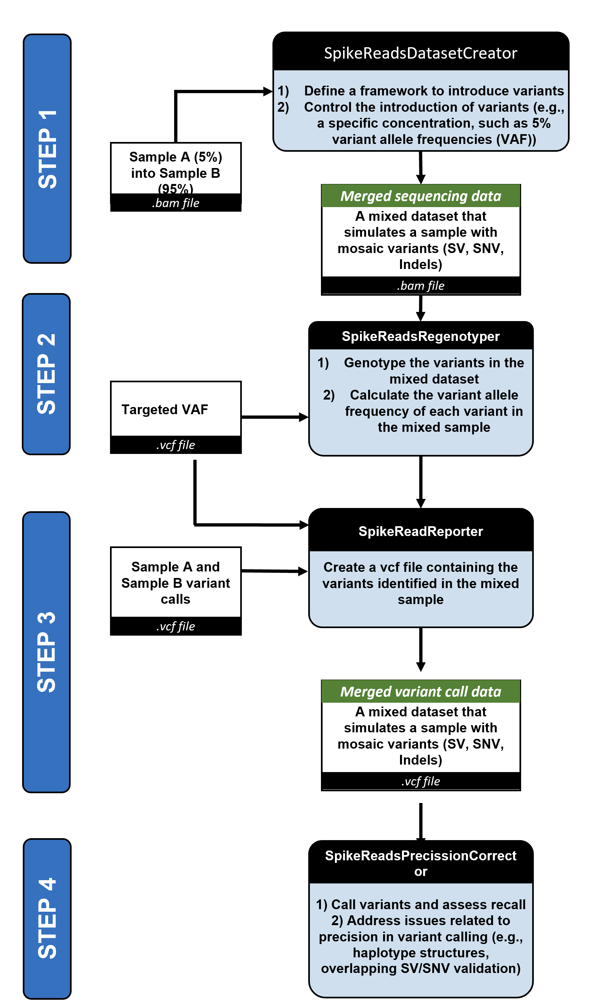
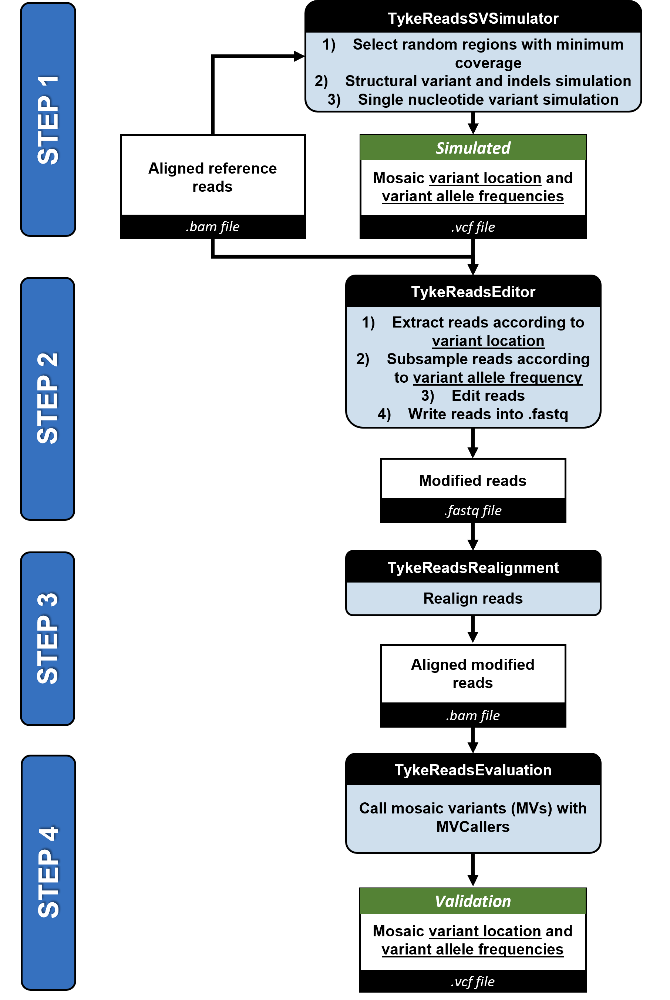

# SVHack_simulatemosaic

## Contributers

Meet SpikeVar and TykeVar:  

## Background

When comparing genomes of individuals, mutations that appear within a small fraction of the population (<5%) are considered rare variants. However, when assessing a population of cells from a tissue of the same individual, rare variants only present in a small fraction of the cells are called a mosaic variants (MVs). MVs are a challenging to identify because they are mixed in with data from the non-mutated cells and present in the same sequencing file. Therefore, several pipelines have been developed to extract these MVs from whole genome sequencing data. To benchmark and validate the efficiency and accuracy of these methods, sequencing files with known MVs are necessary. We developed two simulation workflows called SpikeVar (**Sp**ike **i**n **K**nown **E**xogenous **Var**iants) and TykeVar (**T**aylor in **Y**our **K**ey **E**ndogenous **Var**iants), which output sequencing read files with artificial MVs and a ground truth annotation file for the MVs. SpikeVar accomplishes this by spiking in real reads from a sample at user defined ratio into the sequencing file from a second sample. In contrast, TykeVar creates a list of random mutations and modifies a fraction of existing reads to match the user defined MV frequency.

## Method Description 

### 1. SpikeVar - Generation of sequencing data with a low frequencing of reads from another sample

Here we generate a workflow that can automatically spike in one sample at a given concentration (e.g. 5% at variant allele frequency, VAF) into another sample. We will demonstrate this over spiking in HG002 in to HG0733 for the purpose of demonstration. The downside is that the so generated mixed bam file will include 4 haplotype structures that we cannot correct. The challenging part is further that certain variants (e.g. HG002) will not be presented at the targeted VAF. For example, heterozygous variants wont be represented by 5% VAF but rather at ~2.5% VAF. To account for this we re-genotype variants and report only variants that should be identifiable at the user defined threshold or higher. 

## 2. TykeVar- Creation of sequencing data with a subset of modified reads

Here we modifiy reads directly at their reference position to include artifical mutations. In contrast to the above approach we dont introduce new haplotypes with this. The disadvantage however, is that more complex mutations (e.g. rearrangements, duplication or very long structural variants) will not be able to be introduced to the data itself, since the size of the reads is limited.

To get started, please refer to the [Tyke README](scripts/Tyke/README.md).

## Example Implementation